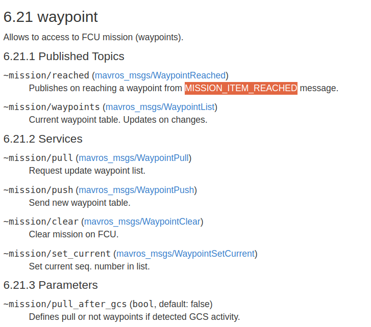

## 一、参考官方资料

官方资料:

-  https://wiki.ros.org/mavros
- https://github.com/mavlink/mavros/blob/master/mavros/README.md
- https://github.com/mavlink/mavros/issues/1500

中文资料：

- https://www.cnblogs.com/chihiro-dong/p/18020611


## 二、mavros坐标系

FCU: PX4中的飞行控制单元  FCU使用的坐标系为NED（北东地）或者FRD（前右下）坐标系

mavros中常用坐标系为ENU（东北天）或者FLU（前左天）**注意：mavros在转换为mavlink发送给FCU时会自动将ENU转换为NED**

（1）坐标系按照功能划分

mavros的话题中常见的坐标系有global坐标系、local坐标系、body坐标系：

- global系好理解，是gps坐标系，经纬度什么的，用的不多；
- local系指当地坐标系，一般是ENU东北天坐标系，坐标原点一般在PX4上电点**（如何修改？）**；
- body坐标系就是指机体坐标系，二进制安装的kinetic版本的mavros，其坐标系是RFU（右前上）坐标系，坐标原点在机体上。之后版本的mavros都统一改为FLU（前左上）坐标系    **（我们用不太上）**

（2）坐标系安装朝向划分

- ENU坐标系：东北天坐标系，也叫站心坐标系，**mavros中的local坐标系一般采用ENU坐标系，例如话题`/mavros/setpoint_position/local`**；
- NED坐标系：北东地坐标系，也叫导航坐标系，PX4的飞控FCU中采用的就是NED坐标系；
- FLU坐标系：前左上坐标系，即无人机机体body坐标系，以无人机为原点，多用于无人机的速度控制，例如话题`/mavros/setpoint_raw/local`话题中的速度就是FLU坐标系的

此外可以通过修改如下指令修改话题的坐标系设置：

```sh
roscd mavros
cd launch/
sudo gedit px4_config.yaml
```

文件里面的`map`坐标系就是`global`系和`local`系，`base_link`坐标系就是`body`系。然后mavros的具体各个话题对应的坐标系还要具体查询


## 三、常用的话题

##### （1）/mavros/state

- 订阅/发布：订阅

- 功能：订阅mavros的一些状态数据，如连接状态、是否解锁、当前无人机模式

- 数据类型：mavros_msgs/State

  ```cpp
  string MODE_PX4_MANUAL=MANUAL
  string MODE_PX4_ACRO=ACRO
  string MODE_PX4_ALTITUDE=ALTCTL
  string MODE_PX4_POSITION=POSCTL
  string MODE_PX4_OFFBOARD=OFFBOARD
  string MODE_PX4_STABILIZED=STABILIZED
  string MODE_PX4_RATTITUDE=RATTITUDE
  string MODE_PX4_MISSION=AUTO.MISSION
  string MODE_PX4_LOITER=AUTO.LOITER
  string MODE_PX4_RTL=AUTO.RTL
  string MODE_PX4_LAND=AUTO.LAND
  string MODE_PX4_RTGS=AUTO.RTGS
  string MODE_PX4_READY=AUTO.READY
  string MODE_PX4_TAKEOFF=AUTO.TAKEOFF
  std_msgs/Header header
    uint32 seq
    time stamp
    string frame_id
  bool connected
  bool armed
  bool guided
  bool manual_input
  string mode
  uint8 system_status
  ```

- 使用示例：

  ```cpp
  // 依赖的库文件有：mavros、roscpp
  
  // 1.头文件需要
  #include <ros/ros.h>
  #include <mavros_msgs/State.h>
  // 2.回调函数，接受状态数据
  mavros_msgs::State current_state;
  void state_cb(const mavros_msgs::State::ConstPtr& msg){
  	current_state = *msg;
  }
  // 3.订阅话题
  ros::Subscriber state_sub = nh.subscribe<mavros_msgs::State>
  	        ("/mavros/state",10,state_cb);
  // 4.获取数据
  // FCU有无连接上，bool
  current_state.connected == true;
  // FCU前飞行状态，string
  current_state.mode == "OFFBOARD";
  // FCU有无解锁，bool
  current_state.armed == true;
  ```

##### （2）/mavros/setpoint_position/local    

- 订阅/发布：发布

- 功能：发布指点飞行，当前坐标系为local当地坐标系，即**以FCU上电为原点的ENU坐标系（东北天）**

- 数据类型：geometry_msgs/PoseStamped

  ```cpp
  std_msgs/Header header
    uint32 seq
    time stamp
    string frame_id
  geometry_msgs/Pose pose
    geometry_msgs/Point position  //local 坐标系下的位置（xyz），只有 position 成员变量生效
      float64 x
      float64 y
      float64 z
    geometry_msgs/Quaternion orientation
      float64 x
      float64 y
      float64 z
      float64 w
  ```

- 使用示例：

  ```cpp
  // 依赖的库文件有：mavros、roscpp、geometry_msgs
  
  // 1.头文件需要
  #include <ros/ros.h>
  #include <geometry_msgs/PoseStamped.h>
  
  // 2.订阅话题
  ros::Publisher local_pose_pub = nh.advertise<geometry_msgs::PoseStamped>
  			("/mavros/setpoint_position/local",10);
  // 3.创建位置数据变量，ENU坐标系
  geometry_msgs::PoseStamped pose;
  // 位置
  pose.pose.position.x = 0;
  pose.pose.position.y = 0;
  pose.pose.position.z = 1;
  // 姿态
  pose.pose.orientation.w = 1;
  pose.pose.orientation.x = 0;
  pose.pose.orientation.y = 0;
  pose.pose.orientation.z = 0;
  // 4.发布定位话题
  local_pose_pub.publish(pose);
  ```

##### （3）/mavros/local_position/pose

- 订阅/发布：订阅

- 功能：话题内容为当前无人机坐标系在local世界坐标系的位姿，local世界坐标系是**以无人机PX4上电点为原点**，三轴朝向为东北天（ENU）；无人机坐标系为body坐标系，三轴朝向为前左上；说明一下IMU中的加速度计的大小问题，也就是线加速度，加速度计是考虑除重力外的合力，也就是说当无人机自由落体运动时，Z轴的加速度为0，当无人机静止放置在地面上时，Z轴加速度为+g，因为此时无人机受到地面的支持力，方向竖直向上，大小为g，所以不要因为静止放置的无人机Z轴加速度为+g，就认为Z轴方向朝下（误认为g是重力）

- 数据类型：geometry_msgs/PoseStamped

  ```cpp
  std_msgs/Header header
    uint32 seq
    time stamp
    string frame_id
  geometry_msgs/Pose pose
    geometry_msgs/Point position
      float64 x
      float64 y
      float64 z
    geometry_msgs/Quaternion orientation
      float64 x
      float64 y
      float64 z
      float64 w
  ```

- 使用示例：

  ```cpp
  // 依赖的库文件有：mavros、roscpp、geometry_msgs
  
  // 1.头文件需要
  #include <ros/ros.h>
  #include <geometry_msgs/PoseStamped.h>
  
  double position[3] = {0,0,0};
  void pos_cb(const geometry_msgs::PoseStamped::ConstPtr& msg){
  	position[0] = msg->pose.position.x;
  	position[1] = msg->pose.position.y;
  	position[2] = msg->pose.position.z;
  }
  // 2.订阅话题
  ros::Subscriber pos_sub = nh.subscribe<geometry_msgs::PoseStamped>
  			("/mavros/local_position/pose",10,pos_cb);
  ```

##### （4）/mavros/local_position/velocity_local

- 订阅/发布：订阅

- 功能：话题内容为当前无人机的三轴速度，包括三轴线速度和三轴角速度，坐标系为local坐标系（以无人机上电点为原点、东北天朝向）

- 数据类型：geometry_msgs/TwistStamped

  ```cpp
  std_msgs/Header header
    uint32 seq
    time stamp
    string frame_id
  geometry_msgs/Twist twist
    geometry_msgs/Vector3 linear
      float64 x
      float64 y
      float64 z
    geometry_msgs/Vector3 angular
      float64 x
      float64 y
      float64 z
  ```

##### （5）/mavros/imu/data(_raw)

- 订阅/发布：订阅

- 功能：话题内容为IMU九轴的数据（XYZ加速度、XYZ角速度、XYZ姿态角），data_raw为原始数据，data为滤波后的数据（**有px4自行生成的四元数数据**）。IMU坐标系为前左上body坐标系。

- 数据类型：sensor_msgs/Imu

  ```cpp
  std_msgs/Header header
    uint32 seq
    time stamp
    string frame_id
  geometry_msgs/Quaternion orientation
    float64 x
    float64 y
    float64 z
    float64 w
  float64[9] orientation_covariance
  geometry_msgs/Vector3 angular_velocity
    float64 x
    float64 y
    float64 z
  float64[9] angular_velocity_covariance
  geometry_msgs/Vector3 linear_acceleration
    float64 x
    float64 y
    float64 z
  float64[9] linear_acceleration_covariance
  ```

##### （6）/mavros/setpoint_accel/accel

- 订阅/发布：发布

- 功能：设置无人机的加速度，**但效果很差，不推荐使用**，如果要控加速度，建议使用控制推力的话题

- 数据类型：geometry_msgs/Vector3Stamped

  ```cpp
  std_msgs/Header header
    uint32 seq
    time stamp
    string frame_id
  geometry_msgs/Vector3 vector
    float64 x
    float64 y
    float64 z
  ```

##### （7）/mavros/setpoint_velocity/cmd_vel_unstamped

- 订阅/发布：发布

- 功能：设置无人机线速度和角速度，坐标系为local坐标系（东北天）

- 数据类型：geometry_msgs/Twist

  ```cpp
  geometry_msgs/Vector3 linear
    float64 x
    float64 y
    float64 z
  geometry_msgs/Vector3 angular
    float64 x
    float64 y
    float64 z
  ```

##### （8）/mavros/setpoint_raw/attitude

- 订阅/发布：发布

- 功能：设置无人机姿态、角速度和推力

- 数据类型：mavros_msgs/AttitudeTarget

  ```cpp
  uint8 IGNORE_ROLL_RATE=1
  uint8 IGNORE_PITCH_RATE=2
  uint8 IGNORE_YAW_RATE=4
  uint8 IGNORE_THRUST=64
  uint8 IGNORE_ATTITUDE=128
  std_msgs/Header header
    uint32 seq
    time stamp
    string frame_id
  uint8 type_mask
  geometry_msgs/Quaternion orientation // 四元数姿态
    float64 x
    float64 y
    float64 z
    float64 w
  geometry_msgs/Vector3 body_rate // 角速度，坐标系测试貌似是body坐标系
    float64 x
    float64 y
    float64 z
  float32 thrust // 推力
  ```

## 四、常用的服务

##### （1）/mavros/cmd/arming

- Server端/Client端：Client端

- 功能：发布解锁/上锁命令

- 数据类型：mavros_msgs/CommandBool

  ```cpp
  bool value // true解锁,false上锁
  ---
  bool success
  uint8 result
  ```

- 使用示例：

  ```cpp
  // 依赖的库文件有：mavros、roscpp
  
  // 1.头文件需要
  #include <ros/ros.h>
  #include <mavros_msgs/CommandBool.h>
  
  // 2.订阅服务
  ros::ServiceClient arming_client = nh.serviceClient<mavros_msgs::CommandBool>
  			("/mavros/cmd/arming");
  // 3.创建变量
  mavros_msgs::CommandBool arm_cmd;
  arm_cmd.request.value = true; // true解锁,false上锁
  
  // 4.请求服务
  if( arming_client.call(arm_cmd) && arm_cmd.response.success){
  	ROS_INFO("Vehicle armed");
  }
  ```

##### （2）/mavros/set_mode

- Server端/Client端：Client端

- 功能：请求切换FCU的飞行模式

- 数据类型：mavros_msgs/SetMode

  ```cpp
  uint8 MAV_MODE_PREFLIGHT=0
  uint8 MAV_MODE_STABILIZE_DISARMED=80
  uint8 MAV_MODE_STABILIZE_ARMED=208
  uint8 MAV_MODE_MANUAL_DISARMED=64
  uint8 MAV_MODE_MANUAL_ARMED=192
  uint8 MAV_MODE_GUIDED_DISARMED=88
  uint8 MAV_MODE_GUIDED_ARMED=216
  uint8 MAV_MODE_AUTO_DISARMED=92
  uint8 MAV_MODE_AUTO_ARMED=220
  uint8 MAV_MODE_TEST_DISARMED=66
  uint8 MAV_MODE_TEST_ARMED=194
  uint8 base_mode
  // 常见的模式有MANUAL、ALTCTL、POSCTL、OFFBOARD、STABILIZED、AUTO.LAND
  string custom_mode
  ---
  bool mode_sent
  ```

- 使用示例：

  ```cpp
  // 依赖的库文件有：mavros、roscpp
  
  // 1.头文件需要
  #include <ros/ros.h>
  #include <mavros_msgs/SetMode.h>
  
  // 2.订阅服务
  ros::ServiceClient set_mode_client = nh.serviceClient<mavros_msgs::SetMode>
  			("/mavros/set_mode");
  // 3.创建变量
  mavros_msgs::SetMode offb_set_mode;
  offb_set_mode.request.custom_mode = "OFFBOARD";
  
  // 4.请求服务
  if( set_mode_client.call(offb_set_mode) && offb_set_mode.response.mode_sent){
  	ROS_INFO("Offboard enabled");
  }
  ```

- 注意：谨慎切换为OFFBOARD模式，特别在实飞中，最好用遥控器切OFFBOARD而不要使用代码自己切，尤其是while循环中不断切换为OFFBOARD，一旦发生意外你需要先杀死这个节点阻止其切换OFFBOARD模式，不然你遥控器无法切出OFFBOARD只能手刹

